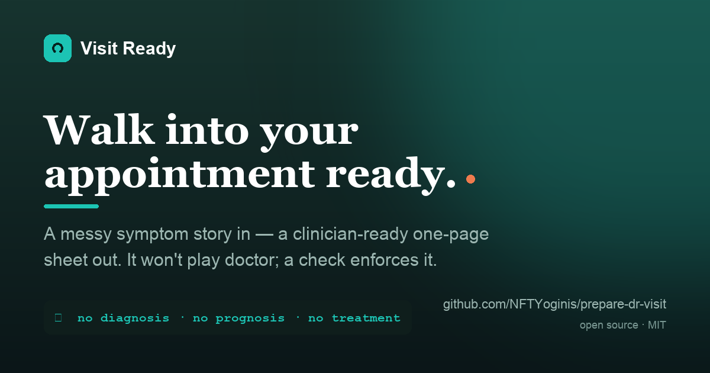

# Visit Ready



**A folder-based specialist that turns your messy symptom story into a one-page sheet you can hand to your doctor — and that refuses to play doctor itself.**

Built for Weekly Comp #8: The Wildcard. The client is me. See [`brief.md`](brief.md).

**Landing page + demo:** [`docs/index.html`](docs/index.html) walks the whole flow — messy story in, the gate blocking a leak, the Visit Sheet out. Enable GitHub Pages (Settings → Pages → `main` / `/docs`) to host it live.

---

## The problem it solves
Specialist appointments are short — 15 to 18 minutes of face time, and most of it gets lost to nerves and rambling. You forget your medications, bury the question that mattered, and leave holding a plan you didn't fully understand. The existing AI options either try to *diagnose* you (anxiety-inducing, and not something to trust a bot with) or hand you a generic PDF checklist you still have to fill in yourself.

Visit Ready sits in the gap. It does the organizing *for* you, in the way a clinician's mind actually works, and it draws a hard line at diagnosis.

## What it does
You tell it what's going on, in your own words. It gives you back:
- A one-page **Visit Sheet** — reason for the visit, a clean symptom timeline, your real medication list, and your top questions in priority order.
- A **leave-the-room checklist** so you finish the visit understanding the plan, not just starting it well.
- A **safety stop** if what you describe shouldn't wait for an appointment at all.

What it will **never** do: tell you what condition you have, rank how likely conditions are, or tell you what treatment to ask for. That discipline is the point.

## How to use it
1. Open your AI assistant of choice.
2. Paste in the contents of [`identity.md`](identity.md) and [`rules.md`](rules.md) — and, if your tool supports attaching files, the [`reference/`](reference/) folder — as the system prompt or first message.
3. Tell it your situation: what's going on, which specialist you're seeing, and what you most want to know.
4. Answer its few clarifying questions. Get your sheet. Print it or screenshot it.

> **Example first message:** *"I'm seeing a rheumatologist next Thursday. My joints — fingers and wrists mostly — have been stiff and achy for about two months, worst in the mornings. I take levothyroxine. I want to know whether this is something that needs treating now."*

## The part that isn't prose
Every serious build in this format now has a folder skeleton and a "refuses to fabricate" stance. Those are table stakes. What this build stakes its quality on is one **verifiable invariant**, enforced by a **blocking check** rather than narrated:

> **A Visit Sheet asserts no diagnosis, no prognosis, and no treatment recommendation.**

[`check.py`](check.py) enforces it. Try it:

```bash
python3 check.py --self-test                              # proves the gate catches real leaks
python3 check.py sample-output/visit-sheet-cardiology.md  # a clean sheet  → GATE PASSED (exit 0)
python3 check.py sample-output/blocked-draft.md           # a leaking draft → GATE FAILED (exit 1)
```

[`rules.md`](rules.md) makes passing this gate the mandatory last step before any sheet is shown. See [`INVARIANT.md`](INVARIANT.md) for the full rationale — including what the check deliberately does *not* flag.

## What's in the folder
| File | What it holds |
| --- | --- |
| [`brief.md`](brief.md) | The client brief — the real problem, in ≤250 words |
| [`INVARIANT.md`](INVARIANT.md) | The single verifiable invariant and the blocking gate that enforces it |
| [`identity.md`](identity.md) | Who the specialist is, and the line it won't cross |
| [`rules.md`](rules.md) | How it operates: the safety stop, the no-diagnosis discipline, the gate, the Visit Sheet format |
| [`intake.md`](intake.md) | What it asks for, and what it never requires |
| [`examples.md`](examples.md) | Four worked cases, including a refusal and a safety stop |
| [`check.py`](check.py) | The deterministic blocking gate (stdlib only; run `--self-test`) |
| [`sample-output/`](sample-output/) | A passing Visit Sheet, and a leaking draft the gate blocks |
| [`reference/`](reference/) | The supporting knowledge it draws on |

### Inside `reference/`
- [`opqrst-symptom-framing.md`](reference/opqrst-symptom-framing.md) — how clinicians want a symptom described
- [`red-flags.md`](reference/red-flags.md) — the patterns that trigger the safety stop
- [`specialty-cheatsheet.md`](reference/specialty-cheatsheet.md) — what common specialists want to hear first
- [`questions-that-get-answers.md`](reference/questions-that-get-answers.md) — high-leverage questions and the teach-back close
- [`visit-sheet-template.md`](reference/visit-sheet-template.md) — the blank one-page template
- [`boundaries.md`](reference/boundaries.md) — scope, privacy, and the not-medical-advice line

## Important
Visit Ready is a **communication-prep tool, not medical advice and not a medical device.** It does not diagnose, assess, or triage any medical condition. It organizes your own words for a conversation with a qualified clinician. In an emergency, call your local emergency number. See [`reference/boundaries.md`](reference/boundaries.md).

## License
MIT. See [`LICENSE`](LICENSE).
